# Roguemon Rivals: Spring Showdown

### [ROUND OVERVIEW](#ROUND-OVERVIEW) | [DRAFTING](#DRAFTING-PHASE) | [PIVOTING](#PIVOTING-GUIDELINES) | [BOONS](#CHAMPION-BOONS) | [TIEBREAKERS](#TIEBREAKERS) | [PENALTIES](#PENALTY-MODIFIERS) | [PARTICIPANTS](#PARTICIPANTS) | [STANDINGS](#STANDINGS) | [DRAFT HISTORY](#DRAFT-HISTORY) | [RESOURCES](#RESOURCES) | [FAQ](#FREQUENTLY-ASKED-QUESTIONS) |

---

Welcome to Roguemon Rivals 2026 Spring Showdown Community Tournament! This open community event is a Roguemon Rivals King of the Hill competition that challenges players to a free for all climb to the top. Each week competitors will fight in a single type to maintain the furthest runs to avoid getting cut from the competition until only the Champion remains.

**If this is your first time playing Roguemon Rivals, more information on how to draft, how to pivot, and how to score your runs can be found on the original rules page ([OG Rules Page](https://github.com/ThePorofessor/Roguemon-Rivals/tree/main)).**

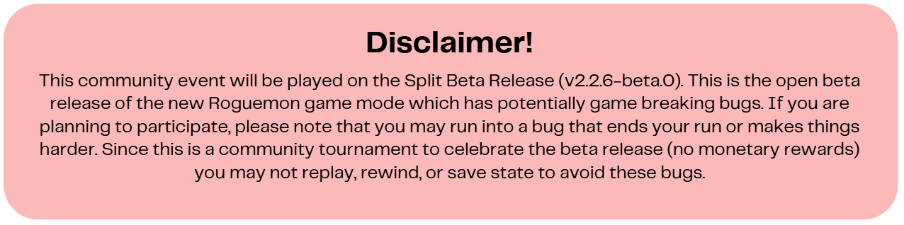

---

<h1 align="center">HOW TO JOIN</h1>

Join our [Community Discord](https://discord.gg/uutypZMtTk) and emote on the tournament announcement or send me a DM on Discord (ThePorofessor) and I will get you the tournament role! Anyone can join until Round 1 ends (June 17th at 11:59 PM). Once round 1 ends the bottom of the leaderboard will be cut and admission will be closed.

---
<h1 align="center">ROUND OVERVIEW</h1>

Each week players will run up to 50 seeds (you are not required to run them all) of a single predetermined type using their [drafted favorite pokemon and universal picks](#DRAFTING-PHASE). At the end of each week, players will be scored based on their furthest run (known as a personal best or PB) and the lower 50% of players will be eliminated from the competition. The top 50% of players will continue onto the next round where a new type and drafting phase will be introduced.For odd player counts, the cut mark will be round up to enable another player to advance.

At the start of each round, the player scores are reset to ensure an even and competitive battle for the top spots. Eventhough the scores are reset, there is significant incentives to reaching the top spots through the [Champion Boon](#CHAMPION-BOONS) system.

---

<h1 align="center">DRAFTING PHASE</h1>

At the start of each round all participants will vote on universal picks that all players may use. Afterwards, players will draft favorites through our Autodrafter which has been finetuned to the Councils ranking system. Please note that the autodrafter will be used for you to select your legal Pokemon and the Nemeses (illegal Pokemon). Due to the high variety of available pivots per type, the number of favorites and universal picks has been scaled to ensure a high probability of seeing your draft each run. The overall process should take less than 5 minutes as it is entirely automated. All participants will have first pick in the draft against the Council. Please note that the pick order against the Council is in a snake style format as shown below:

### 
Drafting Phase Reference

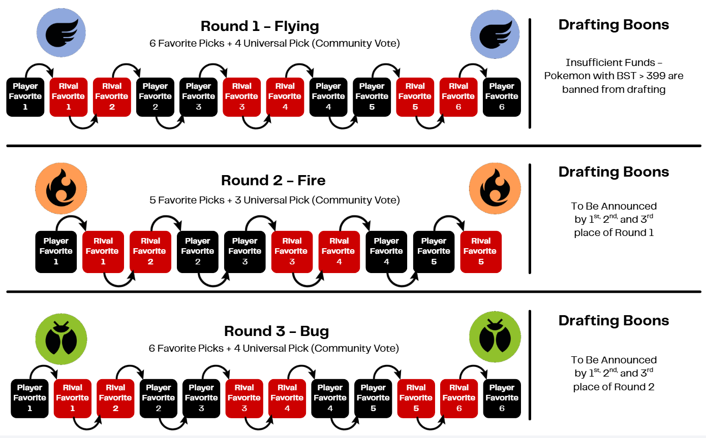

<h1 align="center">PIVOTING GUIDELINES</h1>

Pivoting is dictated by what you drafted. Unlike the classic ruleset for Roguemon Rivals, King of the Hill does not require the abandoned balls. **Repeat everyone can scout for their favorites!** Since scouting is allowed, you can ONLY run your favorite pokemon. Undrafted Pokemon can be used up until the first trainer, but cannot be used as a runner. Nemesis Pokemon are are banned outside of the lab. With that in mind, the lab rules are:

### Lab Priorities:
1.	You must select a drafted pokemon (Universal or Your Favorite)

<strong>Example</strong>

  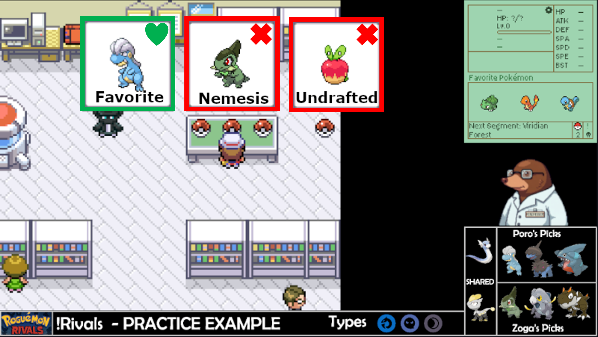

In this example, there is a favorite (Pokemon you drafted or universal pick), a nemesis (Pokemon your opponent drafted), and an undrafted pick.

2.	If you don’t have a favorite, you must fight your opponent’s favorite

<strong>Example</strong>

  

3.	If there are no favorites for either player, you have free choice.

<strong>Example</strong>

  

---

<h1 align="center">CHAMPION BOONS</h1>

At the end of each round, the top scoring players will get the opportunity to add drafting rules (known as boons) to the next round. First place will have options that can drastically change the drafting phase, second place will have a minor change to the drafting phase, and third place will have the chance to ban specific Pokemon. If a player has a specific rule that is not listed below, please contact the competition organizers to see if it would be feasible.

| Boon | Description | Availability | Types |
|:---:|---|---|---|
| **Anti-Social** | The top 20% of community universal votes are banned unless they win the popular vote | 1st Place | All Types |
| **Dictator** | The leader decides all communal universal picks | 1st Place | All Types |
| **Double Trouble** | All favorite picks must contain dual typing | 1st place |              |
| **Draft with Phonics** | Drafts must be picked in alphabetical order | 1st Place | All Types |
| **False Start** | All base game starters are banned from drafting | 1st Place |    |
| **Foster Care** | If a favorite is in the abandoned balls, you must take them | 1st Place | All Types |
| **Insufficient Funds** | Pokemon with BST > 399 are banned from drafting | 1st Place | All Types |
| **Late Bloomers** | Pokemon that would evo in the forest are banned from drafting | 1st Place |           |
| **Monoculture** | All dual typing Pokemon are banned from drafting | 1st Place |           |
| **Weekly Allowance** | Each player's draft may not exceed a BST Limit | 1st Place | All Types |
| | | | |
| **Babysitting** | At least one of your favorites must be a sub-300 BST Pokemon | 2nd Place | All Types |
| **Bougie** | Every player must draft a roguestone evolution | 2nd Place | All Types |
| **Collapsed Mine** | Pokemon that utilize Roguestone Evolutions are banned from drafting | 2nd Place |              |
| **Feel the Rainbow** | Every Player's draft must have at least 3 unique types | 2nd Place | All Types |
| **Influencer** | All players must draft a favorite of your choice | 2nd Place | All Types |
| **Lone Wolves** | Pokemon that utilize friendship evolutions are banned from drafting | 2nd Place |           |
| **Old Dog** | At least one of your favorites must learn 3 or less moves before evo | 2nd Place | All Types |
| | | | |
| **Blacklisted** | Ban a Pokemon from the draft phase (universal vote AND autodrafter) | 3rd Place | All Types |

---

<h1 align="center">TIEBREAKERS</h1>

In the case of multiple players ending on the same segment, there are a few tiebreakers to determine the winner:
1) The player that defeated the most trainers in the final segment wins the tiebreaker.
2) If both players defeated the same number of trainers, then the player who defeated the most pokemon in the final segment wins the tiebreaker.
3) If both players defeated the same number of trainers and pokemon, then the player who reached the personal best in the lower number of seeds (factoring in the penalty modifiers) win the tiebreaker.

**Please note that the final tiebreaker is especially pertinent for tiebreakers that beat Champion.**

<h1 align="center">PENALTY MODIFIERS</h1>

A penalty modifier increases your overall seed count if a specific condition is activated during your longest PB. Please note that this only applies to the third tiebreaker (Players defeating the same number of trainers and pokemon). The modifers are as follows:

<strong> Roguemon Split Penalties </strong>

  

---
<h1 align="center">PARTICIPANTS</h1>

| Name | How To Watch | Tournament Status |
|:---:|---|---|
| 
AitchKay
 | 
[Twitch](https://www.twitch.tv/aitchkay720)
 | 
Round 1
 |
| 
AmazingSpam
 | 
[Twitch](https://www.twitch.tv/amazingspam)
 | 
Round 1
 |
| 
Bolinbear
 | 
[Twitch](https://www.twitch.tv/bolinbear)
 | 
Round 1
 |
| 
BonusDay
 | 
[Twitch](https://www.twitch.tv/bonusday)
 | 
Round 1
 |
| 
Codevelopp
 | 
[Twitch](https://www.twitch.tv/codevelopp)
 | 
Round 1
 |
| 
Finnifinn
 | 
[Twitch](https://www.twitch.tv/finnifinn747)
 | 
Round 1
 |
| 
just_Dkamp
 | 
[Twitch](https://www.twitch.tv/just_dkamp)
 | 
Round 1
 |
| 
Mason
 | 
[Twitch](https://www.twitch.tv/mason_smw)
 | 
Round 1
 |
| 
PixelMaster
 | 
[Twitch](https://www.twitch.tv/pixelmaster113)
 | 
Round 1
 |
| 
Porofessor
 | 
[Twitch](https://www.twitch.tv/theporofessor)
 | 
Round 1
 |
| 
QP_Marcel
 | 
[Twitch](https://www.twitch.tv/qp_marcel)
 | 
Round 1
 |
| 
Reilnur
 | 
[Twitch](https://www.twitch.tv/reilnur)
 | 
Round 1
 |
| 
Roxee
 | 
[Twitch](https://www.twitch.tv/roxee94)
 | 
Round 1
 |
| 
Slammer
 | 
[Twitch](https://www.twitch.tv/iamslammer)
 | 
Round 1
 |
| 
UceyChimchar
 | 
[Twitch](https://www.twitch.tv/uceychimchar)
 | 
Round 1
 |
| 
UnrealPapa | 
[Twitch](https://www.twitch.tv/unrealpapa)
 | 
Round 1
 |
| 
ZogaOak
 | 
[Twitch](https://www.twitch.tv/zogaoak)
 | 
Round 1
 |
| 
ZRBPlays
 | 
[Twitch](https://www.twitch.tv/zrbplaystv)
 | 
Round 1
 |

---

<h1 align="center">STANDINGS</h1>

| Rank | Player | Personal Best (Tiebreakers) | Available Seeds?
|:---:|---|---|---|
| 1 | 
 Mason 
 | 
 Blaine (1/6) 
 | 
 Yes 
 |
| 2 | 
 Porofessor 
 | 
 Silph Co (11/21 Trainers) 
 | 
 Yes 
 |
| 3 | 
 PixelMaster 
 | 
 Koga (5/6 Pokemon) 
 | 
 Yes 
 |
| 4 | 
 Aitchkay 
 | 
 Erika (4/8 Trainers) 
 | 
 No 
 |
| 5 | 
 Reilnur 
 | 
 Rock Tunnel (2/19 Trainers) 
 | 
 No 
 |
| 6 | 
 QP_Marcel 
 | 
 Surge (4/6 Pokemon) 
 | 
 No 
 |
| 7 | 
 Roxee 
 | 
 Misty (5/6 Pokemon - Seed 9) 
 | 
 No 
 |
| 8 | 
 AmazingSpam 
 | 
 Misty (5/6 Pokemon - Seed 34) 
 | 
 Yes 
 |
| 9 | 
 Slammer 
 | 
 Misty (5/6 Pokemon - Seed 41) 
 | 
 Yes 
 |
| | | | |
|
 
 |
 
 |
 
 | 
 
|
| | | | |
| 10 | 
 BonusDay 
 | 
 Misty (3/6 Pokemon) 
 | 
 Yes 
 |
| 11 | 
 Dkamp 
 | 
 Rival 3 (3/4 Pokemon) 
 | 
 No 
 |
| 12 | 
 ZogaOak 
 | 
 Rival 3 (0/4 Pokemon) 
 | 
 No 
 |
| 13 | 
 Bolinbear 
 | 
 Mt Moon (9/12 Trainers) 
 | 
 No 
 |
| 14 | 
 UceyChimchar 
 | 
 Mt Moon (2/12 Trainers) 
 | 
 No 
 |
| 15 | 
 UnrealPapa 
 | 
 Brock (5/6 Pokemon) 
 | 
 No 
 |
| 15 | 
 ZRBPlays 
 | 
 Brock (5/6 Pokemon) 
 | 
 No 
 |
| 17 | 
 Finnifinn 
 | 
 Brock (4/6 Pokemon) 
 | 
 No 
 |
| 18 | 
 Codevelopp 
 | 
 Lab 
 | 
 Yes 
 |

---

<h1 align="center">DRAFT HISTORY</h1>

<strong>Round 1 Drafts (Flying)</strong>

  
| Player 1 | Favorite Picks | Universal Picks |
|:---:|---|---|
| Aitchkay | 
 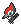 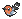  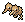 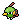 
 | 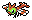 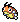 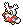 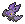 |
| AmazingSpam | 
 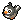 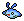 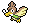   
 |     |
| Bolinbear | 
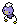  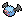  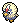 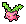 
 |     |
| BonusDay | 
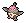      
 |     |
| Codevelopp | 
    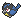  
 |     |
| Dkamp | 
      
 |     |
| Finnifinn | 
     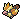 
 |     |
| PixelMaster | 
      
 |     |
| Mason | 
     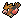 
 |     |
| Porofessor | 
      
 |     |
| QP_Marcel | 
      
 |     |
| Reilnur | 
      
 |     |
| Roxee | 
      
 |     |
| Slammer | 
      
 |     |
| UceyChimchar | 
   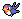   
 |     |
| UnrealPapa | 
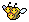      
 |     |
| ZogaOak | 
      
 |     |
| ZRBPlays | 
    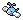  
 |     |

<strong>Round 2 Drafts (Fire)</strong>

  
| Player 1 | Favorite Picks | Universal Picks |
|:---:|---|---|
| | | |

<strong>Round 3 Drafts (Bug)</strong>

  
| Player 1 | Favorite Picks | Universal Picks |
|:---:|---|---|
| | | |

<h1 align="center">RESOURCES</h1>

[Draft Tracker](https://docs.google.com/spreadsheets/d/1w-vIBTVtaFTtdZ5n6jUGxO-SaW-L_5P-QvtL8cfddMo/edit?gid=1594516166#gid=1594516166)

[Pivot Data and Rankings](https://docs.google.com/spreadsheets/d/1zq-M--9Jb4GTpdZMbvmEHwkKGRNkcs_fxrWiKGcLMkY/edit?usp=sharing)

[Pokemon Sprites (Sugimori and Global Artwork)](https://drive.google.com/drive/folders/1QnI2yFlTVyjq3geyzwmnrr3_cxNlNjzI?usp=sharing)

[Pixel Sprites](https://drive.google.com/drive/folders/1IMru_qBCG5OpRwzBwaMIdA040vXDoIP7)

---

<h1 align="center">FREQUENTLY ASKED QUESTIONS</h1>

<strong> How should we approach a run that ends at Cycling Road? </strong>

Cycling Road can be …. troublesome. We understand that you can technically skip Cycling Road due to the lack of mandatory trainers. To ensure a positive competitive environment, we ask that you at least attempt Cycling Road if your opponent has a PB during this segment. If you need to end early that is fine, but a complete skip is frowned upon.
 

<strong> What happens if all lab mons are unselectable? </strong>

Any seeds with only rival Pokemon in the lab should be reset and will not count towards your 50 seeds. This is what we call a seed refund.
 

<strong> What happens if I my lab pokemon has Pure/Huge Power and I only have physical moves? </strong>

Thats a seed reset, but you will be refunded the seed. Please note this doesn't apply to type resistances.
 

<strong> If I get a non-favorite shiny, can I run that instead of a favorite? </strong>

Sure! The original ruleset of Roguemon does have a Shiny clause which we will permit. IIRC the original ruleset for Roguemon allows you to level it to 8 so the shiny has a chance.
 

<strong> How do the penalties for Shell Bell, draining moves, and offensive setup factor into my score? </strong>

These penalties are only factored into winning runs (which is a low chance in A2) and will be utilized for tie breakers if both players win a seed.
 

<strong> Do I need to stream every seed attempt? </strong>

Yes! In order to verify each run and guarantee a fair competitive environment the runs must be watchable. You don't need a webcam and microphone, just visible gameplay. Please make sure that your VODs are available through your preferred streaming service.
 

<strong> Is Discord a permissible alternative to streaming? </strong>

Unfortunately, it is not since the VODs would not be viewable after you ended the run.
 

<strong> Is time machining allowed for simple mistakes? </strong>

To avoid an exhaustive list of yes and no’s, all use of time machine will be banned.
 

---

<h1 align="center">CREDITS</h1>

Created by: [ThePorofessor](https://www.twitch.tv/theporofessor) and [ZogaOak](https://www.twitch.tv/zogaoak)

Draft Tracker and Pixel Sprites Created by: [iAmSlammer](https://www.twitch.tv/iAmSlammer)

Inspired by: [Roguemon by Crozwords](https://github.com/Crozwords/Roguemon)

<i>Roguemon Rivals is a fan-made competition format and not affiliated with Nintendo, Game Freak, or The Pokémon Company.</i>

